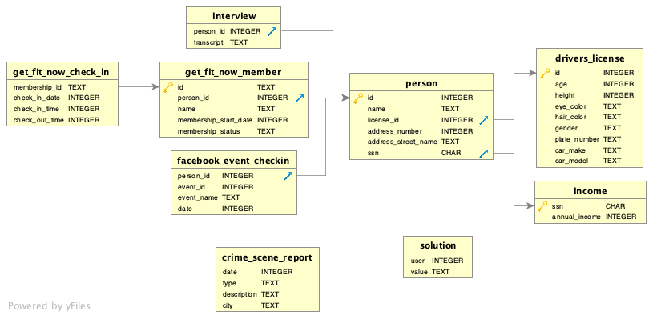

SQL murder mystery
---

[Link to page](https://mystery.knightlab.com/)

The aim is to find the murderer using `SQL` 

# **Start**
A crime has taken place and the detective needs your help. The detective gave you the crime scene report, but you somehow lost it. You vaguely remember that the crime was a **​murder​** that occurred sometime on ​**Jan.15, 2018​** and that it took place in ​**SQL City​**. Start by retrieving the corresponding crime scene report from the police department’s database.

# **Tables**


# **Crime scene**
```sql
SELECT *
FROM crime_scene_report
WHERE date = 20180115 and city = 'SQL City'  
```

Answer : 

| date     | type    | description                                                                                                                                                                               | city     |
| -------- | ------- | ----------------------------------------------------------------------------------------------------------------------------------------------------------------------------------------- | -------- |
| 20180115 | assault | Hamilton: Lee, do you yield? Burr: You shot him in the side! Yes he yields!                                                                                                               | SQL City |
| 20180115 | assault | Report Not Found                                                                                                                                                                          | SQL City |
| 20180115 | murder  | Security footage shows that there were 2 witnesses. The first witness lives at the last house on "Northwestern Dr". The second witness, named Annabel, lives somewhere on "Franklin Ave". | SQL City |
We now know that there were two witnesses, one of whom is called Annabel, whilst for the other we only know the street name.

# **Info Annabel**
```sql
SELECT * 
FROM person
where name like '%Annabel%' and address_street_name = 'Franklin Ave'
```
Answer:

| id    | name           | license_id | address_number | address_street_name | ssn       |
| ----- | -------------- | ---------- | -------------- | ------------------- | --------- |
| 16371 | Annabel Miller | 490173     | 103            | Franklin Ave        | 318771143 |

# **2 witnesses**
```sql
SELECT * 
FROM person
where address_street_name = 'Northwestern Dr'
ORDER BY address_number DESC
```
Answer : 

| id    | name           | license_id | address_number | address_street_name | ssn       |
| ----- | -------------- | ---------- | -------------- | ------------------- | --------- |
| 14887 | Morty Schapiro | 118009     | 4919           | Northwestern Dr     | 111564949 |

# **Interview Annabel**
```sql
Select *
FROM interview
where person_id = 16371
```
Answer : 

| person_id | transcript                                                                                                            |
| --------- | --------------------------------------------------------------------------------------------------------------------- |
| 16371     | I saw the murder happen, and I recognized the killer from my gym when I was working out last week on January the 9th. |
# **Interview Morty**
```sql
Select *
FROM interview
where person_id = 14887
```
Answer : 

| person_id | transcript                                                                                                                                                                                                                      |
| --------- | ------------------------------------------------------------------------------------------------------------------------------------------------------------------------------------------------------------------------------- |
| 14887     | I heard a gunshot and then saw a man run out. He had a "Get Fit Now Gym" bag. The membership number on the bag started with "48Z". Only gold members have those bags. The man got into a car with a plate that included "H42W". |

# **Get Fit Now Member**
```sql
SELECT m.id, m.person_id, m.name, m.membership_status, c.check_in_date
FROM get_fit_now_member m
join get_fit_now_check_in c on m.id = c.membership_id
WHERE m.id LIKE '48Z%'
AND m.membership_status = 'gold'
AND c.check_in_date = 20180109
```
Answer: 

| id    | person_id | name          | membership_status | check_in_date |
| ----- | --------- | ------------- | ----------------- | ------------- |
| 48Z7A | 28819     | Joe Germuska  | gold              | 20180109      |
| 48Z55 | 67318     | Jeremy Bowers | gold              | 20180109      |

# **Murderer**

```sql
SELECT p.name, p.license_id, d.id, d.plate_number
FROM person p
JOIN drivers_license d ON p.license_id = d.id
WHERE (p.id = 28819 OR p.id = 67318) 
AND d.plate_number LIKE '%H42W%'
```
Answer:

| name          | license_id | id     | plate_number |
| ------------- | ---------- | ------ | ------------ |
| Jeremy Bowers | 423327     | 423327 | 0H42W2       |

# **Answer**
```sql
INSERT INTO solution VALUES (1, 'Jeremy Bowers');
        
        SELECT value FROM solution;
```
Answer:

|value|
|---|
|Congrats, you found the murderer! But wait, there's more... If you think you're up for a challenge, try querying the interview transcript of the murderer to find the real villain behind this crime. If you feel especially confident in your SQL skills, try to complete this final step with no more than 2 queries. Use this same INSERT statement with your new suspect to check your answer.|

# **Bonus**
```sql
SELECT *
FROM interview
WHERE person_id = 67318
```
Answer:

|person_id|transcript|
|---|---|
|67318|I was hired by a woman with a lot of money. I don't know her name but I know she's around 5'5" (65") or 5'7" (67"). She has red hair and she drives a Tesla Model S. I know that she attended the SQL Symphony Concert 3 times in December 2017.

```sql
SELECT f.person_id, p.name, COUNT(f.event_name) AS EventAttendance
FROM facebook_event_checkin f
JOIN person p ON f.person_id = p.id
JOIN drivers_license d ON p.license_id = d.id
WHERE d.height BETWEEN 65 AND 67
AND d.hair_color = 'red'
AND d.gender = 'female'
AND d.car_make = 'Tesla'
AND d.car_model = 'Model S'
AND f.event_name = 'SQL Symphony Concert'
```
Answer:

|person_id|name|EventAttendance|
|---|---|---|
|99716|Miranda Priestly|3|
# **Bonus answer**
```sql
INSERT INTO solution VALUES (1, 'Miranda Priestly');
        
        SELECT value FROM solution;
```
Answer:

|value|
|---|
|Congrats, you found the brains behind the murder! Everyone in SQL City hails you as the greatest SQL detective of all time. Time to break out the champagne!|
